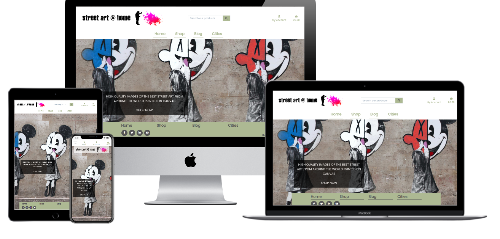

<a name="top"></a>
<div align="center">

</div>

---

# Street Art @ Home 

---
## Links

### [Aim of the site](#aim)
### [User stories](#userstories)
### [Site plan](#plan) and [Features/Wireframes](#features)
### [Theme & typography](#theme)
### [Database features & design](#database)
### [Features left to implement](#left)
### [Technologies used](#tech)
### [Testing](#testingsection)
- [Code testing](#code)
- [Manual testing](#manual)
- [User story testing](#usertesting)
- [Further testing](#further)
- [Screen-size testing](#screen)
### [Deployment](#deploy)
### [Issues & bugs](#issues)
### [Credits & acknowledgements](#credits)

---
<a name="aim"></a>

## :dart: Aim of the site

Street art @ home is designed for a fictional company, and designed to showcase and sell prints on canvas of photographs of graffiti and street-art for buyers to put on walls at home. The precise details of the artwork location and artist is indicative rather than 100% true.

## [Link to live site](https://street-art-at-home.herokuapp.com/) opens in same tab, click back if needed

### [Top of page](#top)

<a name="userstories"></a>

## :woman: User Stories 

| As a | I want to be able to | So that I can |
| --- | --- | --- |
| Shopper | View products | Choose ones to buy |
| Shopper | View individual products | View detail on individual products |
| Shopper | Check out interesting new street art | Have access to cutting edge |
| Shopper | View my shopping bag | Know what I am spending |
| |
| Site user | Know what the site is about at first glance | Check immediately whether this is the site for me |
| Site user | Easily register an account | Hold an account and view profile |
| Site user | Easily login or out | Access and use personal information |
| Site user | Have a personal profile | View order and payment history |
|    |
| Shopper | Search for a product by name or description | Find a specific product by city |
| Shopper | Easily see what I have searched for | Make a decision on whether this is a product I want | 
| Shopper | Select the quantity of items to buy | Add to my cart and buy |
| Shopper | View the items in my bag | See the items I have added and want to buy |
| Shopper | Adjust the quantity of items in my bag | Make changes to the quantity chosen |
| Shopper | Remove items from my shopping bag | Change to not buying an item if I change my mind |
| Shopper | Have the ability to order as a guest | Order even if not registered |
| Shopper | Easily enter payment information | Buy the items in my final choice |
| Shopper | View an order confirmation post checkout | So I am assured in knowing the items purchased are the ones I wanted |


### [Top of page](#top)
---
## :compass: Site plan, features & wireframes

<a name="plan"></a>

### Site plan

Click [here](media/ms4siteplan.pdf) for the site plan, opens in same tab, click back if needed

<a name="features"></a>

## Features & Wireframes

### Landing page

[Desktop Wireframe](wireframes/homedesktop.png)
[Mobile Wireframe](wireframes/homemobile.png)

Designed to be simple, clean and give a main image with clear links to the possibility to be able to shop as well as a description of what the site is for. This, and all other pages will have a header with a logo and navbar links to the shop, a blog, a Cities area, the shopping basket and user account area. Also, on all views their will be a product search bar present.

The concept of the search bar is to drive users towards the commercial aspects of the site and will search product titles and description only (eg, not blog and cities entries). 

### All products

[Desktop Wireframe](wireframes/all_productsdesktop.png)
[Mobile Wireframe](wireframes/all_productsmobile.png)

A page showing every product that can be purchased (image, title, price), and a "back to top icon".

### One product

[Desktop Wireframe](wireframes/one_productdesktop.png) /
[Mobile Wireframe](wireframes/one_productmobile.png)

A page showing an individual product, chosen from the all_products view with a description of all fields, the ability to plus or minus the quantity to order and buttons to give the user the ability to continue shopping or add the relevant number of items to the basket.

### Sign up

[Desktop Wireframe](wireframes/signupdesktop.png) /
[Mobile Wireframe](wireframes/signupmobile.png)

A page giving the user the ability to be able to create an account using their personal detail with buttons to sign-in/submit or navigate to the login page if they realise that they do actually have an account already.

### Sign in

[Desktop Wireframe](wireframes/logindesktop.png) /
[Mobile Wireframe](wireframes/loginmobile.png)

A simple page giving the user the ability to enter their username and password that they have to login to their account. Home and Sign-in (process) buttons to be present.

### Profile

[Desktop Wireframe](wireframes/myaccountdesktop.png) /
[Mobile Wireframe](wireframes/myaccountmobile.png)

A simple page giving the user the ability to view their profile details and update if required.

### Basket

[Desktop Wireframe](wireframes/bagdesktop.png) /
[Mobile Wireframe](wireframes/bagmobile.png)

A page showing an image of all items ordered as well as a breakdown of item price and total price. Buttons giving the ability to continue shopping or to go to the checkout app if the user has finished shopping.

### Checkout

[Desktop Wireframe](wireframes/checkoutdesktop.png) /
[Mobile Wireframe](wireframes/checkoutmobile.png)

A page giving the user the ability to review and purchase all chosen items in the bag. A Keep Shopping and Checkout button present.

### Blog

[Desktop Wireframe](wireframes/blogdesktop.png) /
[Mobile Wireframe](wireframes/blogmobile.png)

A simple page with images and detail of added blog items related to the subject areas and designed to showcase the cutting edge.

### Cities

[Desktop Wireframe](wireframes/citiesdesktop.png) /
[Mobile Wireframe](wireframes/citiesmobile.png)

A page giving an overview of our favourite cities in terms of street art.

### [Top of page](#top)
---
<a name="theme"></a>

## :art: Theme & typography

Colours are designed to be largely soft and pastel like but with the option for the addition of a bold pink colour where needed, and a dark grey to give emphasis, the below colour palette was generated using [coolors](https://coolors.co/)

<div align="center">

</div>

### [Top of page](#top)

<a name="database"></a>

## :floppy_disk: Database features/design

Data is stored in three models;

**Products**

***Consisting of 6 subsets;***

1: Sku- Numerical identifier,
2: Name- Product name,
3: City- City located in,
4: Description- Overview of product,
5: Price_l: Price in GBP,
6: Image: Image of piece

**Blogentries**

Consisting of 6 subsets;

1: Blogid- Numerical identifier,
2: Blogposter- Name of poster,
3: Blogdate- Date of blog posting,
4: Blogtitle- Heading of blog,
5: Blogtext- Main text of blog article,
6: Blogimage- Article image

**Citiesentries**

Consisting of 4 subsets;

1: Citiesid- Numerical identifier,
2: Citiestitle- Title of entry (city),
3: Citiestext- Main text of cities article,
4: Image- Article image


### [Top of page](#top)
---
<a name="left"></a>

## :lock: Features left to implement

- In the future I would like to add the option for users to be able to choose from various sized images or even custom ones. I would also add email functionality to both the user login process and order confirmation process.

### [Top of page](#top)
---
<a name="tech"></a>

## :bulb: Technologies used

- HTML, CSS, Javascript & Python languages
- [Google fonts](https://fonts.google.com/) for Poppins font used through all pages, opens in same tab, press back to return, opens in same tab, press back to return
- [Font Meme](https://fontmeme.com/) for logo font, opens in same tab, press back to return
- [Gitpod](https://www.gitpod.io/) IDE used to code, opens in same tab, press back to return
- [GitHub](https://github.com/) To host the repositories for this project, opens in same tab, press back to return
- [Balsamiq](https://balsamiq.com/) used to design wireframes, opens in same tab, press back to return
- [Django](https://www.djangoproject.com/) as the database storemain framework used, opens in same tab, press back to return
- [Coolors](https://coolors.co/) used for colour palette, opens in same tab, press back to return
- [Bootstrap](https://getbootstrap.com/) front-end framework used, opens in same tab, press back to return
- [Hover.css](https://ianlunn.github.io/Hover/) used to add button hover effect , opens in same tab, press back to return
- [Tiny PNG](https://tinypng.com/) used to compress some images used, opens in same tab, press back to return
- [Heroku](https://dashboard.heroku.com/apps) used to deploy project, opens in same tab, press back to return
- [Flaticon.com](http://www.freepik.com) used for spray can favicon, opens in same tab, press back to return
- [Dreamtimes.com](https://www.dreamstime.com/) used for graffiti man image, opens in same tab, press back to return
- [Cursor.cc](https://www.cursor.cc/) used to generate graffiti spray can cursor, opens in same tab, press back to return
- Stripe


### [Top of page](#top)
---
<a name="testingsection"></a>

## :goggles: Testing
<a name="code"></a>

### Code

- **HTML:** All tested with [W3S HTML Validation Service](https://validator.w3.org/), checked by rendering each page in the browser and right clicking and viewing ```Page source``` to ensure code being rendered excludes the templating language

- **CSS:** style.css tested with [W3C CSS Validation Service](https://jigsaw.w3.org/css-validator/validator)

- **Javascript:** scripts.js tested with [JSLint](https://jslint.com/)

- **Python:** Code tested with pylint:


<a name="manual"></a>

### Manual Testing


<a name="usertesting"></a>

### User story testing

Tested against [User Stories](#userstories)

| As a | I want to be able to | Achieved |
| --- | --- | --- |
| Shopper | View products | :thumbsup: |
| Shopper | View individual products | :thumbsup: |
| Shopper | Check out interesting new street art | :thumbsup: |
| Shopper | View my shopping bag | :thumbsup: |
| |
| Site user | Know what the site is about at first glance | :thumbsup: |
| Site user | Easily register an account | :thumbsup: |
| Site user | Easily login or out | :thumbsup: |
| Site user | Have a personal profile | :thumbsup: |
|    |
| Shopper | Search for a product by name or description | :thumbsup: |
| Shopper | Easily see what I have searched for | :thumbsup: | 
| Shopper | Select the quantity of items to buy | :thumbsup: |
| Shopper | View the items in my bag | :thumbsup: |
| Shopper | Adjust the quantity of items in my bag | :thumbsup: |
| Shopper | Remove items from my shopping bag | :thumbsup: |
| Shopper | Have the ability to order as a guest | :thumbsup: |
| Shopper | Easily enter payment information | :thumbsup: |
| Shopper | View an order confirmation post checkout | :thumbsup: |


<a name="further"></a>

### Further testing


<a name="screen"></a>

### Screen size Testing


### [Top of page](#top)
---
<a name="deploy"></a>

## :computer: Deployment

To deploy to Heroku:

- Sign in to [Heroku dashboard](https://dashboard.heroku.com/apps)
- Create a new app by clicking `Create new app` in the `New` dropdown box
- Choose a relevant and unique app name
- Add Heroku Postgres as an add-on
- In the Config Vars add the relevant variables for:
    - SECRET_KEY
    - STRIPE_PUBLIC_KEY
    - STRIPE_WH_KEY
    - DATABASE_URL
    - USE_AWS (set to True)
    - AWS_ACCESS_KEY
    - AWS_SECRET_ACCESS_KEY
    - DISABLE_COLLECT_STATIC, set to 1 (In this case as I uploaded static and media files manually)
- Freeze the requirements in the terminal by typing
'pip3 freeze > requirements.txt'
- Create a Procfile and save the below code into item<br>
`web: gunicorn street_art_at_home.wsgi:application`
- To set the database so it works with Postgres comment out the current database settings and add the below code to settings.py<br>
    `DATABASES = {<br>
        'default': dj_database_url.parse(database_url_from_heroku_config_vars)<br>
        }`
- Run migrations
- Create a superuser by typing
`python3 manage.py createsuperuser`
- Revert back to the original setup in settings.py
- Add the below code in an if statement
   `if 'DATABASE_URL' in os.environ:<br>
    DATABASES = {<br>
        'default': dj_database_url.parse(os.environ.get("DATABASE_URL"))<br>
        }<br>
    else:<br>
    DATABASES = {<br>
        'default': {<br>
            'ENGINE': 'django.db.backends.sqlite3',<br>
            'NAME': BASE_DIR / 'db.sqlite3',<br>
        }<br>
    }`
- Add the app name to ALLOWED_HOSTS in settings.py
- To make it easier, set Heroku to deploy automatically when code is pushed to GitHub


### [Top of page](#top)
---
<a name="issues"></a>

## :ant: Issues & bugs

### Closed issues

- I had issues in terms of the automatic upload of static and media files to AWS. To deal with this I opted for a manual upload to populate. In future, I would attempt to make this an automatic process.


### Open issues

- Styling of the Django admin page. I have not been able to correct this and the Django admin page is very basic in looks. The functionality is 100% present however and I took the decision to leave as is.

### [Top of page](#top)
---
<a name="credits"></a>

## :clap: Credits & acknowledgements

- Template for footer taken from [colorlib.com](https://codepen.io/hasib_technobari/pen/QmNxwy) and style customised for own site

- As always, the advice and support from my mentor Rohit 


### [Top of page](#top)
---
