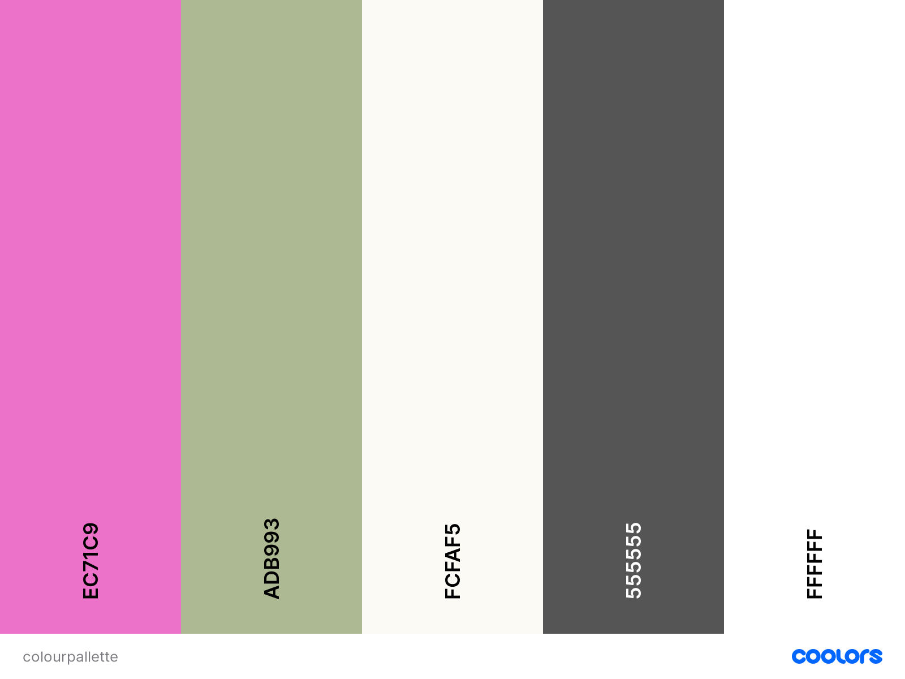
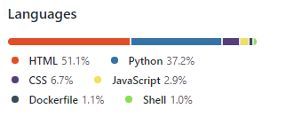
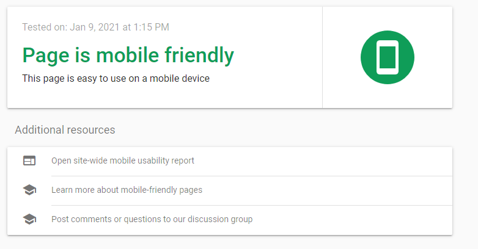

<a name="top"></a>
<div align="center">

</div>

<div align="center">
<h1>street art @ home</h1>
</div>

---

     

---

<div align="center">

</div>

---

## Links

### :dart: [Aim of the site](#aim)
### :woman: [User stories](#userstories)
### :compass: [Site plan](#plan) and [Features/Wireframes](#features)
### :art: [Theme & typography](#theme)
### :floppy_disk: [Database features & design](#database)
### :lock: [Features left to implement](#left)
### :bulb: [Technologies used](#tech)
### :test_tube: [Testing](#testingsection)
- [Code testing](#code)
- [Manual testing](#manual)
- [User story testing](#usertesting)
- [Further testing](#further)
- [Screen-size testing](#screen)
### :computer: [Deployment](#deploy)
### :ant: [Issues & bugs](#issues)
### :clap: [Credits & acknowledgements](#credits)

---
<a name="aim"></a>

## :dart: Aim of the site

Street art @ home is designed for a fictional company, designed to showcase and sell prints on canvas of photographs of graffiti and street-art, for buyers to put on walls at home. The precise details of the artwork location and artist is indicative rather than 100% true.

To test the login and account functionality create any dummy user (eg test123@test.com). To check-out, use the card number 4242 4242 4242 4242, expiry of any future date and postcode of any 5 integers.

## [Link to live site](https://street-art-at-home.herokuapp.com/) opens in same tab, click back if needed

### :arrow_up:[Top of page](#top)

---

<a name="userstories"></a>

## :woman: User Stories

| As a | I want to be able to | So that I can |
| --- | --- | --- |
| Shopper | View all products | Choose the ones I like |
| Shopper | View individual products | View detail on individual products |
| Shopper | Check out interesting new street art | Have access to new trends |
| Shopper | View my shopping bag | Know what I am spending |
| |
| Site user | Know what the site is about at first glance | Check immediately whether this is the site for me |
| Site user | Easily register an account | Hold an account and view profile |
| Site user | Easily login or out | Access and use personal information |
| Site user | Have a personal profile | View order and payment history |
|    |
| Shopper | Search for a product by name or description | Find a specific product by city |
| Shopper | Easily see what I have searched for | Make a decision on whether this is a product I want | 
| Shopper | Select the quantity of items to buy | Add to my cart and buy |
| Shopper | View the items in my bag | See the items I have added and want to buy |
| Shopper | Adjust the quantity of items in my bag | Make changes to the quantity chosen |
| Shopper | Remove items from my shopping bag | Change to not buying an item if I change my mind |
| Shopper | Have the ability to order as a guest | Order even if not registered |
| Shopper | Easily enter payment information | Buy the items in my final choice |
| Shopper | View an order confirmation post checkout | So I am assured in knowing the items purchased are the ones I wanted |

[See here for user story testing](#usertesting)

### :arrow_up:[Top of page](#top)
---
## :compass: Site plan, features & wireframes

<a name="plan"></a>

### Site plan

Click [here](readmeimages/ms4siteplan.pdf) for the site plan, opens in same tab, click back if needed

<a name="features"></a>

## Features & Wireframes

### Landing page

[Desktop Wireframe](wireframes/homedesktop.png) <sub><sup> or </sup></sub> 
[Mobile Wireframe](wireframes/homemobile.png)

Designed to be simple, clean and give a main image with clear links to the possibility to be able to shop as well as a description of what the site is for. This, and all other pages will have a header with a logo and navbar links to the shop, a blog, a Cities area, the shopping basket and user account area. Also, on all views there will be a product search bar present. On smaller screens this search functionality will be achieved through a icon with a dropdown search box.

The concept of the search bar is to drive users towards the commercial aspects of the site, and will search product titles and description only (eg, not blog and cities entries). 

A footer will appear on the home page only to avoid cluttering other pages.

### All products

[Desktop Wireframe](wireframes/all_productsdesktop.png) <sub><sup> or </sup></sub> 
[Mobile Wireframe](wireframes/all_productsmobile.png)

A page showing every product that can be purchased (image, title, price), and a "back to top" icon.

### One product

[Desktop Wireframe](wireframes/one_productdesktop.png) <sub><sup> or </sup></sub>
[Mobile Wireframe](wireframes/one_productmobile.png)

A page showing an individual product, chosen from the all_products view with a description of all fields, the ability to plus or minus the quantity to order and buttons to give the user the ability to continue shopping or add the relevant number of items to the basket.

### Sign up

[Desktop Wireframe](wireframes/signupdesktop.png) <sub><sup> or </sup></sub>
[Mobile Wireframe](wireframes/signupmobile.png)

A page giving the user the ability to be able to create an account using their personal detail, with buttons to submit & sign-in, or navigate to the login page if they realise that they do actually have an account already.

### Sign in

[Desktop Wireframe](wireframes/logindesktop.png) <sub><sup> or </sup></sub>
[Mobile Wireframe](wireframes/loginmobile.png)

A simple page giving the user the ability to enter their username and password that they have to login to their account. Home and Sign-in (process) buttons to be present.

### Profile

[Desktop Wireframe](wireframes/myaccountdesktop.png) <sub><sup> or </sup></sub>
[Mobile Wireframe](wireframes/myaccountmobile.png)

A simple page giving the user the ability to view their profile details and update if required.

### Basket

[Desktop Wireframe](wireframes/bagdesktop.png) <sub><sup> or </sup></sub>
[Mobile Wireframe](wireframes/bagmobile.png)

A page showing an image of all items ordered as well as a breakdown of item price and total price. Buttons giving the ability to continue shopping or to go to the checkout app if the user has finished shopping.

### Checkout

[Desktop Wireframe](wireframes/checkoutdesktop.png) <sub><sup> or </sup></sub>
[Mobile Wireframe](wireframes/checkoutmobile.png)

A page giving the user the ability to review and purchase all chosen items in the bag. A Keep Shopping and Checkout button present.

### Blog

[Desktop Wireframe](wireframes/blogdesktop.png) <sub><sup> or </sup></sub>
[Mobile Wireframe](wireframes/blogmobile.png)

A simple page with images and detail of added blog items related to the subject areas and designed to showcase trends & events.

### Cities

[Desktop Wireframe](wireframes/citiesdesktop.png) <sub><sup> or </sup></sub>
[Mobile Wireframe](wireframes/citiesmobile.png)

A page giving an overview of our favourite cities in terms of street art.

### 404 & 500 pages

Just uses the template used on all views, with a large button as well as the navbar to enable the user to be able to navigate to anywhere in the site. 

### :arrow_up:[Top of page](#top)
---
<a name="theme"></a>

## :art: Theme & typography

Colours are designed to be largely soft and pastel like, but with the option for the addition of a bold pink colour where needed, and a dark grey to give emphasis, the below colour palette was generated using [coolors](https://coolors.co/)

<div align="center">

</div>

### :arrow_up:[Top of page](#top)

---

<a name="database"></a>

## :floppy_disk: Database features/design

As well as the user information, data is stored in three models;

**Products**

***Consisting of 6 subsets;***

- Sku- Numerical identifier
- Name- Product name
- City- City located in
- Description- Overview of product
- Price_l: Price in GBP
- Image: Image of piece

**Blogentries**

***Consisting of 6 subsets;***

- Blogid- Numerical identifier
- Blogposter- Name of poster
- Blogdate- Date of blog posting
- Blogtitle- Heading of blog
- Blogtext- Main text of blog article
- Blogimage- Article image

**Citiesentries**

***Consisting of 4 subsets;***

- Citiesid- Numerical identifier
- Citiestitle- Title of entry (city)
- Citiestext- Main text of cities article
- Image- Article image


### :arrow_up:[Top of page](#top)
---
<a name="left"></a>

## :lock: Features left to implement

- In the future and if this were a real business I would like to add the option for users to be able to choose from various sized images or even custom ones to order. 
- I would also add email functionality to both the user login process and order confirmation process.
- To develop the site further it would be useful to add the option for users to be able to sign in with their social media or other accounts.
- Testing has been done manually and I would aim to do this programmatically.

### :arrow_up:[Top of page](#top)
---
<a name="tech"></a>

## :bulb: Technologies used

- HTML, CSS, Javascript & Python languages
- [Google fonts](https://fonts.google.com/) for Poppins font used through all pages, opens in same tab, press back to return, opens in same tab, press back to return
- [Font Meme](https://fontmeme.com/) for logo font, opens in same tab, press back to return
- [Gitpod](https://www.gitpod.io/) IDE used to code, opens in same tab, press back to return
- [GitHub](https://github.com/) to host the repositories for this project, opens in same tab, press back to return
- [Git](https://git-scm.com/) for version control, , opens in same tab, press back to return
- [Balsamiq](https://balsamiq.com/) used to design wireframes, opens in same tab, press back to return
- [Django](https://www.djangoproject.com/) used as the framework to create the app and the template language
- [Coolors](https://coolors.co/) used for colour palette, opens in same tab, press back to return
- [Bootstrap](https://getbootstrap.com/) front-end framework used, opens in same tab, press back to return
- [Hover.css](https://ianlunn.github.io/Hover/) used to add button hover effect , opens in same tab, press back to return
- [Tiny PNG](https://tinypng.com/) used to compress some images used, opens in same tab, press back to return
- [Heroku](https://dashboard.heroku.com/apps) used to deploy project, opens in same tab, press back to return
- [Flaticon.com](http://www.freepik.com) used for spray can favicon, opens in same tab, press back to return
- [Dreamtimes.com](https://www.dreamstime.com/) used for graffiti man image, opens in same tab, press back to return
- [Cursor.cc](https://www.cursor.cc/) used to generate graffiti spray can cursor, opens in same tab, press back to return
- [Stripe](https://stripe.com/gb) used to process credit card transactions, opens in same tab, press back to return
- [AWS](https://aws.amazon.com/) used to store static and media files
- [Fontawesome](https://fontawesome.com/) used for various icons across the site, opens in same tab, press back to return

### Languages used breakdown

<div align="left">

</div>
<sub><sup> Current result may show a slight difference due to late and ongoing changes </sup></sub>

### :arrow_up:[Top of page](#top)
---
<a name="testingsection"></a>

## :test_tube: Testing
<a name="code"></a>
- [Code testing](#code)
- [Manual testing](#manual)
- [User story testing](#usertesting)
- [Further testing](#further)
- [Screen-size testing](#screen)

### Code

- **CSS:** style.css tested with [W3C CSS Validation Service](https://jigsaw.w3.org/css-validator/validator), no errors found

- **Javascript:** all JS tested with [JSLint](https://jslint.com/), no errors found

- **Python:** Code tested by typing `python3 -m flake8` to test all .py files
    
All issues have been corrected except for the below exceptions;

- Errors that were automatically generated (the init files, migration files, Django setup files etc). This constitutes the majority of issues
- Some E501 errors remain as the lines cannot be shortened
- Some E128 errors remain as the flake8 check would need them for be indented far too much in to pass and would not be user friendly
- Some DJ01 errors remain as this setting should be present


<a name="manual"></a>

### Manual Testing

#### Home page

The below items are in the base.html files and apply to all pages. appearance cross-referenced against the [site features](#features) section above.

- Tested the logo to check that the home page is rendered
- Tested the `Home` link on the navbar to check that the home page is rendered
- Tested the `Shop` link on the navbar to check that the /products page is rendered
- Tested the `Blog` link on the navbar to check that the /blog page is rendered
- Tested the `Cities` link on the navbar to check that the /cities page is rendered
- Tested the search box from all views to check that the relevant products are displayed when the word searched is in the product title or product description
- Tested the search box to check that no items are displayed when the word searched does not exist in the product title or product description
- Tested the `My Account` link on the navbar to check that the correct dropdowns display dependent on whether the user is logged in or not
- Tested all dropdown options coming from `My Account` being clicked to check that the correct page is displayed or action
- Tested the shopping basket icon to check that the /bag page is rendered

Specific to the home page.

- Tested the `Home` link in the footer to check that the home page is rendered
- Tested the `Shop` link in the footer to check that the /products page is rendered
- Tested the `Blog` link in the footer to check that the /blog page is rendered
- Tested the `Cities` link in the footer to check that the /cities page is rendered
- Tested the social media icons to check that the relevant social media home page is rendered and opens in another tab
- Tested the `SHOP NOW` button to check that the /products page is rendered

### All products page

- Tested to check that all products in the database are displayed correctly (image, title and size)
- Tested to check that a user click on all individual images displays the relevant /products/<product_id> page
- Tested the back to top icon brings the user back to the top of the page

### One product page

- Tested to check that the relevant image, title, price and description are displayed
- Tested to check that the `KEEP SHOPPING` button brings the user back to the /products page
- Tested the increment buttons increment up and down correctly and only operate within the range 0-99 as desired
- Tested the `ADD TO BAG` button to check that the product is added to the shopping bag when clicked and the relevant toast displays

### Sign Up/Register page

- Tested to check that the dropdown link to `Register` renders the correct /accounts/signup page
- Tested to check that the `Sign in` link renders the correct /accounts/login page
- Tested the form validation to check that the email section must be an email, the password must be a valid one and match and that a check is performed to check whether the email exists already in the database
- Tested the `BACK TO LOGIN` button to check that the correct page is rendered
- Tested the `SIGN UP` button successfully registers a new user if the form passes validation and the relevant toast is displayed advising the user of the successful registration and the home page is then rendered

### Sign in page

- Tested to check that the `HOME` button renders the home page when clicked
- Tested the user is signed in if a valid username and password are entered, a toast is displayed and the home page is rendered
- Tested an error message is displayed if the user types in incorrect information for either the username and/or password

### Profile page

- Tested to check that the relevant user information in stored and displayed
- Tested to check that the correct user order history is displayed
- Tested to check that the `UPDATE INFORMATION` updates the profile when clicked and a toast is displayed advising the user of the successful change
- Tested to check that when a user clicks on a particular order that the order information is displayed as well as a toast advising the user that this is a past order
- Tested to check that `BACK TO PROFILE` button on the above rendered page renders the /profile page

### Basket

- Tested to check that the correct view and information is rendered if no items are in the basket and a (tested and working) button is present to bring the user to the /products page
- Tested to check that the correct items are displayed and the price and amount ordered is correct
- Total amount tested to check that the bag s adding all products and calculating correctly
- Tested to check that the user name is displayed if the user is logged in and if not, then a "Shop as a guest" message is displayed
- Tested the `KEEP SHOPPING` button renders the correct /products page when clicked
- Tested the `SECURE CHECKOUT` button renders the /checkout.html page
- Tested the increment buttons increment up and down correctly and only operate within the range 0-99 as desired
- Tested the `Update` button saves the basket as the new amount when clicked

### Checkout

- Tested to check that the correct order is rendered as a summary
- Tested to check that if the user is not logged in, then they are advised that they are about to check out as a guest and given the (working) option of being able to create an account
- Tested to check that if the user is logged in then the order form is pre-populated with any stored profile information
- Tested the `Save this to my profile` checkbox works and updates the profile if there are any changes made when finally placing the order
- Tested to check that the `Adjust bag` button renders the /bag page
- Tested the form validation on the required fields to check that this information is present when the `Complete Order` button is clicked
- Tested the Stripe functionality works and when the valid test card number is used then the user is given an order summary and a toast showing their order has been made

### Blog

- Tested to check that all images, posting person, posting date, title and summary are correctly displayed
- Tested the back to top icon brings the user back to the top of the page 

### Cities

- Tested to check that all images, title and summary are correctly displayed
- Tested the back to top icon brings the user back to the top of the page 

<a name="usertesting"></a>

### User story testing

Tested against [User Stories](#userstories)

| As a | I want to be able to | Achieved |
| --- | --- | --- |
| Shopper | View products | :thumbsup: |
| Shopper | View individual products | :thumbsup: |
| Shopper | Check out interesting new street art | :thumbsup: |
| Shopper | View my shopping bag | :thumbsup: |
| |
| Site user | Know what the site is about at first glance | :thumbsup: |
| Site user | Easily register an account | :thumbsup: |
| Site user | Easily login or out | :thumbsup: |
| Site user | Have a personal profile | :thumbsup: |
|    |
| Shopper | Search for a product by name or description | :thumbsup: |
| Shopper | Easily see what I have searched for | :thumbsup: | 
| Shopper | Select the quantity of items to buy | :thumbsup: |
| Shopper | View the items in my bag | :thumbsup: |
| Shopper | Adjust the quantity of items in my bag | :thumbsup: |
| Shopper | Remove items from my shopping bag | :thumbsup: |
| Shopper | Have the ability to order as a guest | :thumbsup: |
| Shopper | Easily enter payment information | :thumbsup: |
| Shopper | View an order confirmation post checkout | :thumbsup: |


<a name="further"></a>

### Further testing

- Mobile friendly test: Site reports as "Mobile friendly" when using [Mobile-friendly](https://search.google.com/test/mobile-friendly)

<div align="center">

</div>

- Tested on various browsers: Edge, Chrome, Firefox, Internet Explorer

<a name="screen"></a>

### Screen size Testing

- Using Chrome dev tools tested all features on;

Moto G4, Galaxy S5, Pixel 2, Pixel 2 XL, iPhone5/SE, iPhone 6/7/8, iPhone 6/7/8 Plus, iPhone X, iPad, iPad Pro, Surface Duo, Galaxy fold

### :arrow_up:[Top of page](#top)
---
<a name="deploy"></a>

## :computer: Deployment

### To deploy to Heroku:

- Sign in to [Heroku dashboard](https://dashboard.heroku.com/apps)
- Create a new app by clicking `Create new app` in the `New` dropdown box
- Choose a relevant and unique app name
- Add Heroku Postgres as an add-on
- In the Config Vars add the relevant variables for:
    - SECRET_KEY
    - STRIPE_PUBLIC_KEY
    - STRIPE_WH_KEY
    - DATABASE_URL
    - USE_AWS (set to True)
    - DISABLE_COLLECT_STATIC, set to 1 (In this case as I uploaded static and media files manually)
- Freeze the requirements in the terminal by typing
'pip3 freeze > requirements.txt'
- Create a Procfile and save the below code into item<br>
`web: gunicorn street_art_at_home.wsgi:application`
- To set the database so it works with Postgres comment out the current database settings and add the below code to settings.py<br>
``` python
DATABASES = {
    'default': dj_database_url.parse(database_url_from_heroku_config_vars)
    }
```
- Run migrations
- Create a superuser by typing
`python3 manage.py createsuperuser`
- Revert back to the original setup in settings.py
- Add the below code in an if statement<br>
``` python
if 'DATABASE_URL' in os.environ:
    DATABASES = {
        'default': dj_database_url.parse(os.environ.get("DATABASE_URL"))
        }
else:
    DATABASES = {
        'default': {
            'ENGINE': 'django.db.backends.sqlite3',
            'NAME': BASE_DIR / 'db.sqlite3',
        }
    }
```
- Add the app name to ALLOWED_HOSTS in settings.py
- To make it easier, set Heroku to deploy automatically when code is pushed to GitHub

### Amazon Web Services

- Go to [AWS](https://aws.amazon.com/)
- Search for S3 and create a new bucket, give this bucket the same name as the Heroku app
- Unblock public access and finish creating the bucket
- In the permissions tab, edit cross origin resource sharing (CORS) and paste the below in<br>
``` python
[
  {
      "AllowedHeaders": [
          "Authorization"
      ],
      "AllowedMethods": [
          "GET"
      ],
      "AllowedOrigins": [
          "*"
      ],
      "ExposeHeaders": []
  }
]
```
- Select `Policy Generator` to create a new security Policy
- Select S3 Bucket Policy as the type of policy and add a * to principle
- Set the Action to Get Object and paste in the ARN (Amazon Resource Name)
- Click `Add Statement`, then `Generate Policy`
- Copy the policy and paste it into the bucket policy editor
- Make sure a * is added to the end of the `Resource` value to allow access to all resources in the bucket
- In the ACL (Access Control List), set list object permissions for everyone
- Open IAM (Identity and Access Management) and create a group giving it a name
- Go the the `Policies` tab and choose `Create Policy`
- Select `Import Managed Policy` from the JSON tab, search for S3 and import `S3 Full Access Policy`
- Back on S3, copy the ARN and paste this twice in to the Resource item. The second arn line should have a /* on the end like the below
`"arn:aws:s3:::bucket/*"`
- Click `Review Policy`, name it and give it a decription before clicking `Create Policy`
- Search for the policy created and click `Attach Policy`
- Then create a user from the `User` tab by clicking `Add User`
- Give the user a name and allow the user programmatic access
- Add the user to the group, click `end` until done 
- Download the CSV file which will contain the access keys, be sure to save the file as it can only be downloaded once
- For Django to connect to S3, install boto3 and django-storages
- Also add 'storages' to the installed apps in settings.py
- Add the 2 AWS keys to the config vars in the Heroku config vars
- Add the below if statement to settings.py to check that USE_AWS is set to true<br>
``` python
if 'USE_AWS' in os.environ:
    AWS_STORAGE_BUCKET_NAME = 'street-art-at-home'
    AWS_S3_REGION_NAME = 'eu-west-2'
    AWS_ACCESS_KEY_ID = os.environ.get('AWS_ACCESS_KEY_ID')
    AWS_SECRET_ACCESS_KEY = os.environ.get('AWS_SECRET_ACCESS_KEY')
    AWS_S3_CUSTOM_DOMAIN = f'{AWS_STORAGE_BUCKET_NAME}.s3.amazonaws.com'
```

I had challenges in automating the upload of static and media files and took the decision to manually upload them, to do this I followed the below steps:

- Download a ZIP file of the GitHub repository
- Extract the files from the ZIP
- Create 2 folders in the AWS bucket, `static` and `media`
- Upload all the static files from the unzipped folder into the static folder in AWS
- Copy everything from the IDE `media` folder into the AWS folder `media`
- Heroku will now have access and be able to use the static and media folders from AWS


### :arrow_up:[Top of page](#top)
---
<a name="issues"></a>

## :ant: Issues & bugs

### Closed issues

- I had issues in terms of the automatic upload of static and media files to AWS. To deal with this I opted for a manual upload to populate. In future, I would attempt to make this an automatic process.


### Open issues

- Styling of the Django admin page. The Django in-built styling of the admin page comes from the static files. As the static files are not automatically uploading to AWS the admin page is unstyled. Still 100% functional and this has not been corrected.

### [:arrow_up:Top of page](#top)
---
<a name="credits"></a>

## :clap: Credits & acknowledgements

- Template for footer taken from [colorlib.com](https://codepen.io/hasib_technobari/pen/QmNxwy) and style customised for own site

- As always, the advice and support from my mentor Rohit 

- The Code Institute Boutique Ado project walk-through was vital in assisting me in this process

- As always, so much research and troubleshooting was gained by extensive use of [StackOverflow](https://stackoverflow.com/)


### :arrow_up:[Top of page](#top)
---


