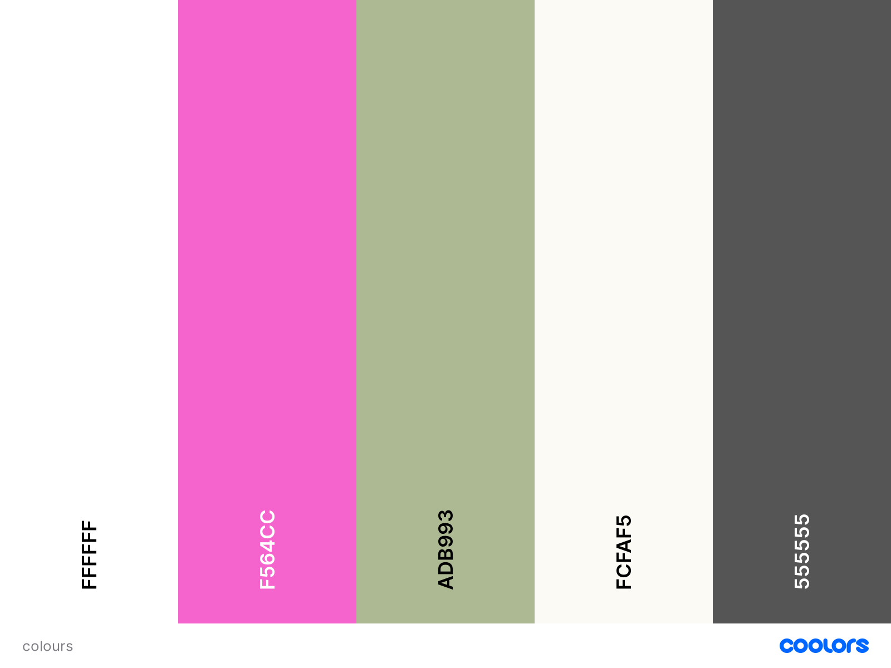

<a name="top"></a>
<div align="center">

</div>

---

# Street Art @ Home 

---
## Links

### [Aim of the site](#aim)
### [User stories](#userstories)
### [Site plan](#plan) and [Features/Wireframes](#features)
### [Theme & typography](#theme)
### [Database features & design](#database)
### [Features left to implement](#left)
### [Technologies used](#tech)
### [Testing](#testingsection)
- [Code testing](#code)
- [Manual testing](#manual)
- [User story testing](#usertesting)
- [Further testing](#further)
- [Screen-size testing](#screen)
### [Deployment](#deploy)
### [Issues & bugs](#issues)
### [Credits & acknowledgements](#credits)

---
<a name="aim"></a>

## Aim of the site

Street art @ home is for a fictional company, and designed to showcase and sell prints on canvas of photographs of graffiti and street-art for buyers to put on walls at home. The precise details of the artwork location and artist is indicative rather than 100% true.

## [Link to live site](#) opens in same tab, click back if needed

### [Top of page](#top)

<a name="userstories"></a>

## User Stories 

| As a | I want to be able to | So that I can |
| --- | --- | --- |
| Shopper | View products | Choose ones to buy |
| Shopper | View individual products | View detail on individual products |
| Shopper | Check out interesting new street art | Have access to cutting edge |
| Shopper | View my shopping bag | Know what I am spending |
| |
| Site user | Easily register an account | Hold an account and view profile |
| Site user | Easily login or out | Access and use personal information |
| Site user | Receive a post registration email | Know my registration has worked |
| Site user | Have a personal profile | View order and payment history |
|    |
| Shopper | Sort the list of available products | Narrow down the range to desired products |
| Shopper | Search for a product by name or description | Find a specific product |
| Shopper | Easily see what I have searched for | Make a decision on whether this is a product I want | 


### [Top of page](#top)
---
## Site plan, features & wireframes

<a name="plan"></a>

### Site plan

Click [here]() for the site plan, opens in same tab, click back if needed

<a name="features"></a>

## Features & Wireframes

### Landing page

[Desktop Wireframe](wireframes/home_desktop.png)
[Mobile Wireframe]()

Designed to be simple, clean and give a main image with clear links to the possibility to be able to shop as well as a description of what the site does. This, and all other pages will have a header with a logo and navbar links to the shop, a blog, an "About Us" area, the shopping basket and user admin area. Below this and on all pages will be a search bar,

### All products

[Desktop wireframe](wireframes/all_products_desktop.png)
[Mobile Wireframe]()

A page showing every produc that can be purchased, a filter and a "back to top icon".

### One product

[Desktop wireframe](wireframes/one_product_desktop.png)
[Mobile Wireframe]()

A page showing an individual product chosen with a description of all fields, the ability to plus or minus the quantity to order and buttons to give the user the ability to continue shopping or add the relevant number of items to the basket.

### [Top of page](#top)
---
<a name="theme"></a>

## Theme & typography

Colours are designed to be largely soft and pastel like but with the option for the addition of a bold pink colour where needed, and a dark grey to give emphasis, the below colour palette was generated using [coolors](https://coolors.co/)

<div align="center">

</div>

### [Top of page](#top)

<a name="database"></a>

## Database features/design

All data is stored


### [Top of page](#top)
---
<a name="left"></a>

## Features left to implement


### [Top of page](#top)
---
<a name="tech"></a>

## Technologies used

- HTML, CSS, Javascript & Python languages
- [Google fonts](https://fonts.google.com/) for Poppins font used through all pages, opens in same tab, press back to return, opens in same tab, press back to return
- [Font Meme](https://fontmeme.com/) for logo font, opens in same tab, press back to return
- [Gitpod](https://www.gitpod.io/) IDE used to code, opens in same tab, press back to return
- [GitHub](https://github.com/) To host the repositories for this project, opens in same tab, press back to return
- [Balsamiq](https://balsamiq.com/) used to design wireframes, opens in same tab, press back to return
- [Django](https://www.djangoproject.com/) as the database storemain framework used, opens in same tab, press back to return
- [Coolors](https://coolors.co/) used for colour palette, opens in same tab, press back to return
- [Bootstrap](https://getbootstrap.com/) front-end framework used, opens in same tab, press back to return
- [Hover.css](https://ianlunn.github.io/Hover/) used to add button hover effect , opens in same tab, press back to return
- [Tiny PNG](https://tinypng.com/) used to compress some images used, opens in same tab, press back to return
- [Heroku](https://dashboard.heroku.com/apps) used to deploy project, opens in same tab, press back to return
- [Flaticon.com](http://www.freepik.com) used for spray can favicon, opens in same tab, press back to return
- [Dreamtimes.com](https://www.dreamstime.com/) used for graffiti man image, opens in same tab, press back to return

### [Top of page](#top)
---
<a name="testingsection"></a>

## Testing
<a name="code"></a>

### Code

- **HTML:** All tested with [W3S HTML Validation Service](https://validator.w3.org/), checked by rendering each page in the browser and right clicking and viewing ```Page source``` to ensure code being rendered excludes the templating language

- **CSS:** style.css tested with [W3C CSS Validation Service](https://jigsaw.w3.org/css-validator/validator)

- **Javascript:** scripts.js tested with [JSLint](https://jslint.com/)

- **Python:** Code tested with pylint:


<a name="manual"></a>

### Manual Testing


<a name="usertesting"></a>

### User story testing

Tested against [User Stories](#userstories)


<a name="further"></a>

### Further testing


<a name="screen"></a>

### Screen size Testing


### [Top of page](#top)
---
<a name="deploy"></a>

## Deployment


## How to run this project locally from Gitpod


### [Top of page](#top)
---
<a name="issues"></a>

## Issues & bugs

### Closed issues


### Open issues


### [Top of page](#top)
---
<a name="credits"></a>

## Credits & acknowledgements

 

### [Top of page](#top)
---
